# Envanter ve Zimmet Takip Sistemi

Kurum içi bilişim envanterinin, cihaz zimmetlerinin ve yazılım lisanslarının tek
bir yerden takip edilmesi için geliştirilmiş web tabanlı yönetim uygulaması.

Amaç, envanterin dağınık Excel dosyalarında tutulmasından kaynaklanan sorunları
gidermektir: hangi cihazın kimde olduğu, cihazın IP adresi, hangi lisansın hangi
makinede kurulu olduğu ve bakım/garanti sürelerinin ne zaman dolacağı tek bir
kayıt üzerinden izlenebilir.

> **Not:** Depodaki tüm veriler örnektir. Personel adları, IP adresleri, seri
> numaraları ve lisans anahtarları tamamen uydurmadır; gerçek bir kuruma ait veri
> içermez.

## Özellikler

- **Cihaz envanteri** — envanter kodu, tür, marka/model, seri no, IP ve MAC
  adresi, lokasyon, departman ve durum bilgisiyle donanım kaydı
- **Zimmet yönetimi** — cihazı personele zimmetleme, başka personele devretme ve
  depoya iade alma; her işlem geçmişe kaydedilir
- **Lisans takibi** — ürün, üretici, lisans türü, koltuk sayısı, başlangıç/bitiş
  tarihi ve satın alma bedeli; koltuk aşımı otomatik tespit edilir
- **Arama ve filtreleme** — cihaz kodu, marka, model, seri no, IP veya zimmetli
  personele göre arama; durum, tür ve lokasyona göre filtreleme
- **Raporlar** — bakımı gecikmiş/yaklaşan cihazlar, garantisi dolanlar, süresi
  dolan lisanslar, koltuk aşımı ve depoda bekleyen cihazlar
- **CSV dışa aktarma** — cihaz, personel ve lisans listeleri Excel'de doğrudan
  açılabilecek biçimde (UTF-8 BOM + noktalı virgül ayraç) indirilebilir

## Ekranlar

Aşağıdaki görüntüler `npm run db:seed` ile yüklenen örnek veri üzerinden
alınmıştır; görülen tüm personel adları, IP adresleri ve lisans anahtarları
uydurmadır.

### Panel

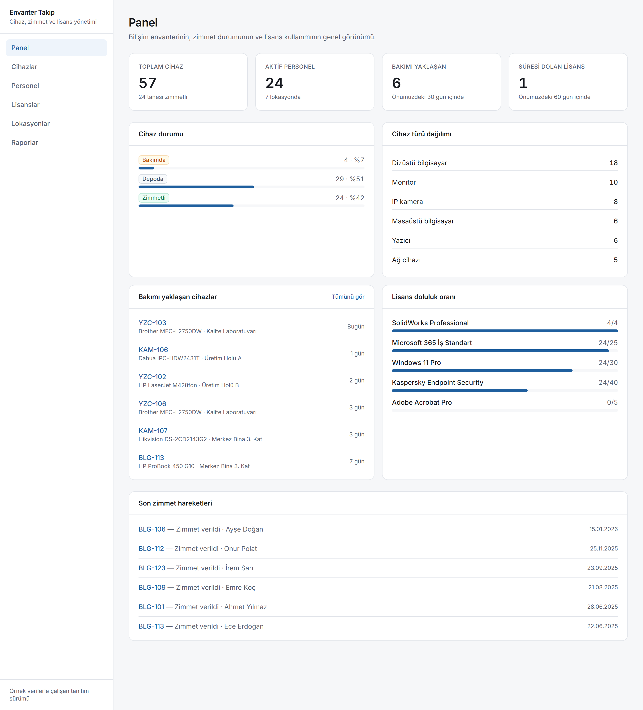

Açılış ekranı üstte dört sayaç (toplam cihaz, aktif personel, bakımı yaklaşan
cihaz, süresi dolan lisans), altında dört kart gösterir: cihazların duruma göre
dağılımı, cihaz türü kırılımı, bakım tarihi yaklaşan cihazlar ve lisansların
koltuk doluluk oranı. En altta son zimmet hareketleri tarih sırasıyla listelenir.
Listelerdeki her envanter kodu ilgili cihazın detay sayfasına bağlıdır.

### Cihaz listesi

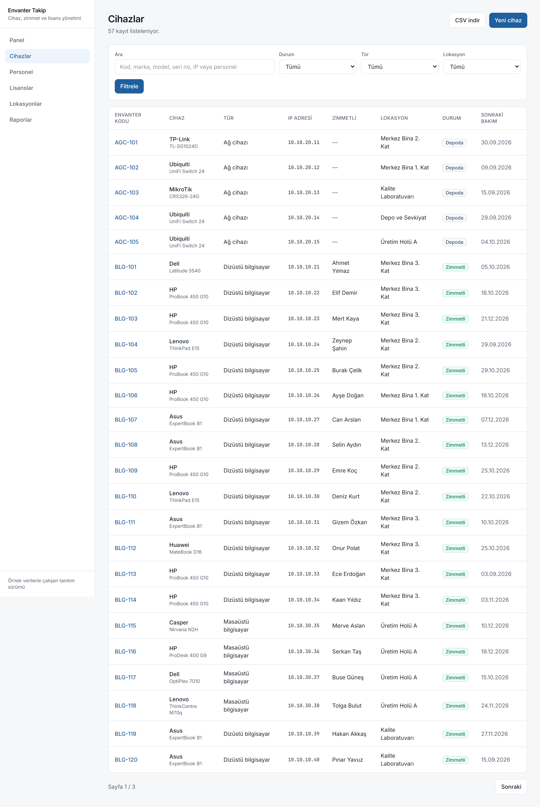

Cihazlar sayfalanarak listelenir. Envanter kodu, marka ve model, tür, IP adresi,
zimmetli personel, lokasyon, durum ve sonraki bakım tarihi tek tabloda görülür;
zimmetli olmayan cihazlarda personel sütunu tire ile gösterilir. Durum rozetleri
renkle ayrışır (yeşil zimmetli, gri depoda, turuncu bakımda).

### Duruma göre filtreleme

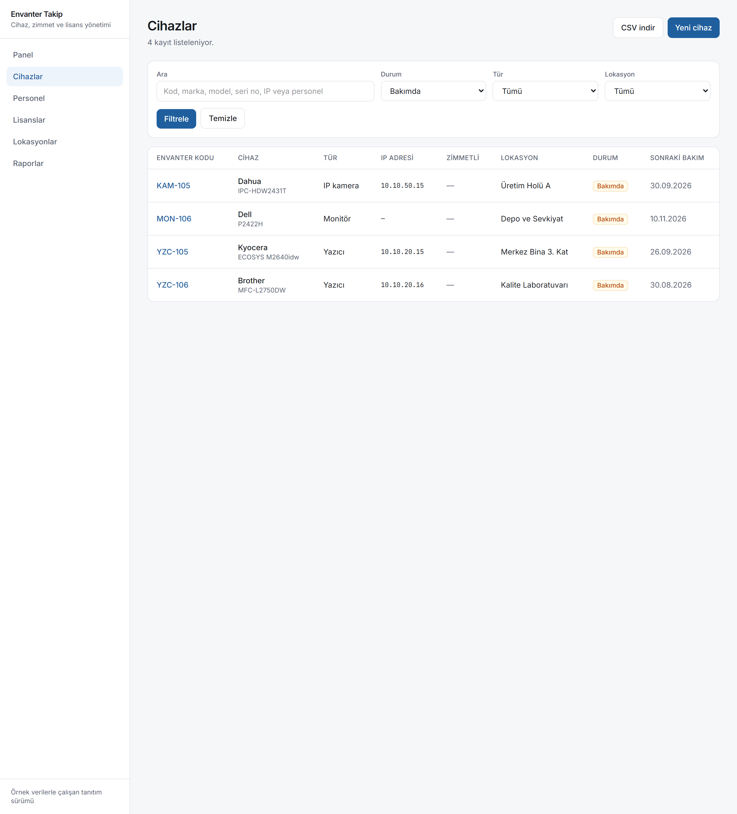

Durum, tür ve lokasyon açılır listeleri birlikte uygulanır. Görüntüde durum
"Bakımda" seçilmiş ve liste 4 kayda inmiştir. Seçilen filtreler adres satırında
sorgu parametresi olarak tutulduğundan sonuç bağlantısı olduğu gibi
paylaşılabilir; "Temizle" düğmesi tüm filtreleri sıfırlar.

### Serbest metin araması

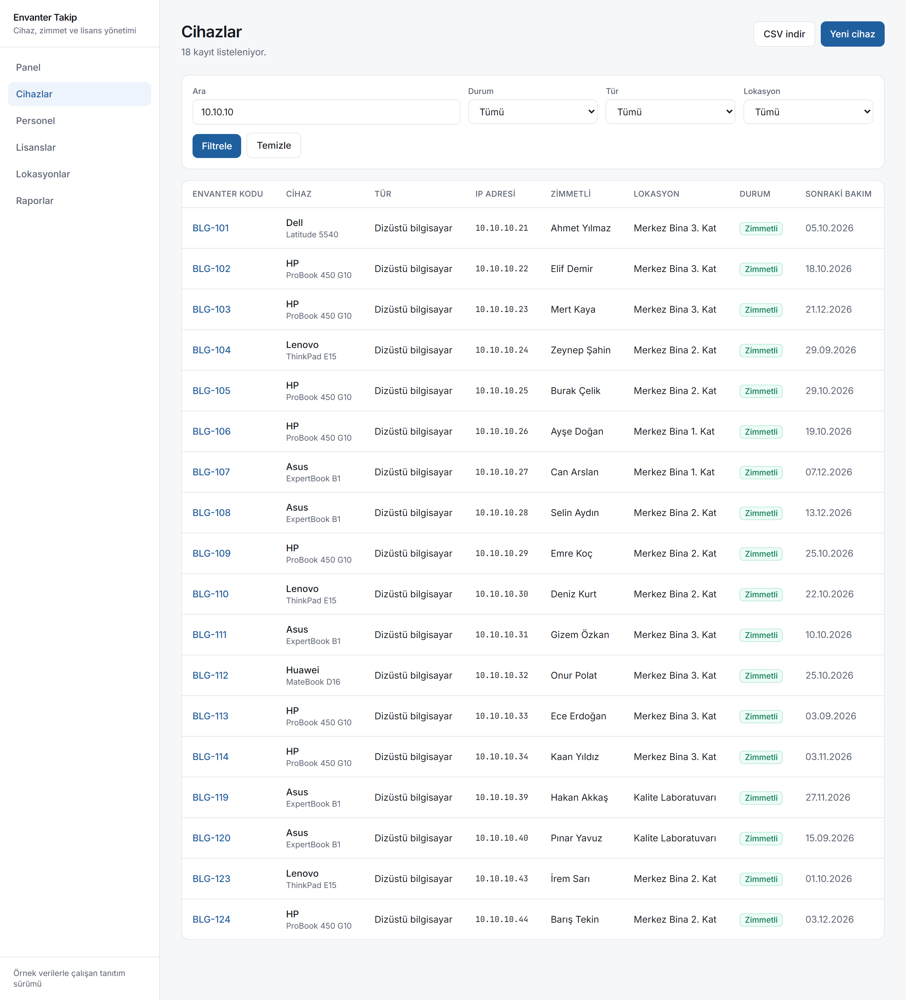

Tek arama kutusu envanter kodu, marka, model, seri numarası, IP adresi ve
zimmetli personel adı alanlarının hepsinde birden arar. Görüntüde `10.10.10`
yazılarak o alt ağa ait 18 cihaz süzülmüştür.

### Cihaz detayı ve zimmet işlemleri

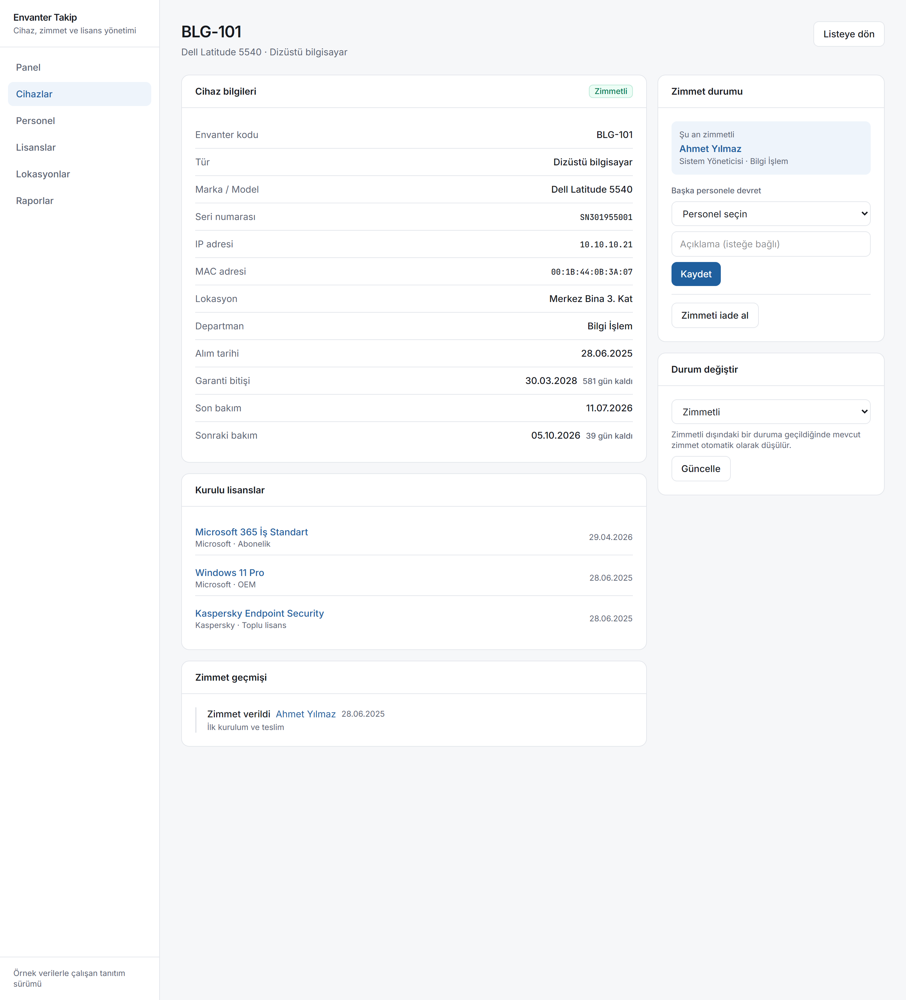

Sol sütun cihazın künyesidir; garanti ve bakım tarihlerinin yanında kalan gün
sayısı hesaplanarak yazılır. Sağ sütun işlem panelidir: cihaz başka bir
personele devredilebilir, zimmeti iade alınabilir veya durumu değiştirilebilir.
Altta cihaza kurulu lisanslar ve cihazın zimmet geçmişi yer alır.

### Yeni cihaz kaydı

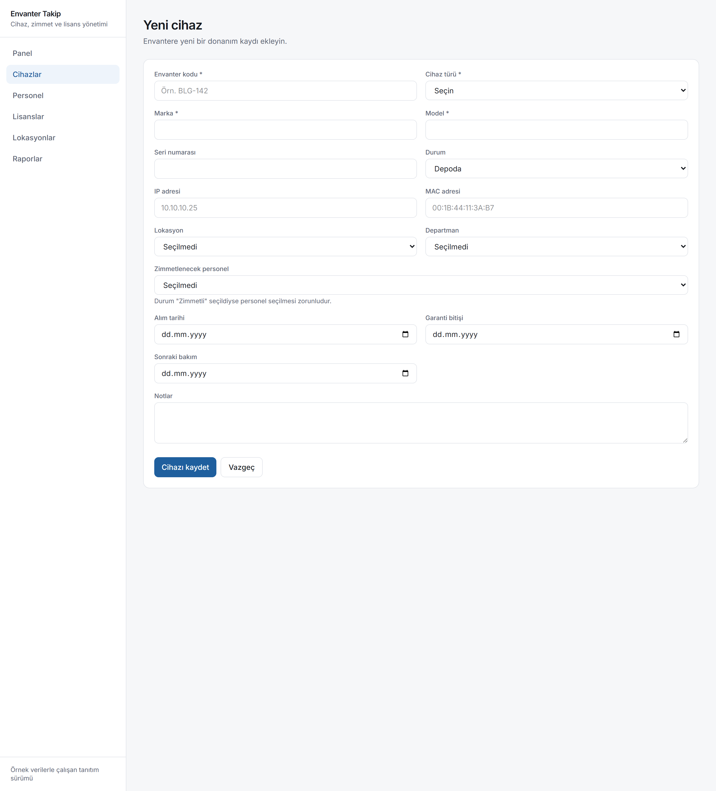

Zorunlu alanlar yıldızla işaretlidir. Durum "Zimmetli" seçildiğinde personel
seçimi de zorunlu hâle gelir; bu kural formda belirtilmekle kalmaz, kaydı
işleyen Server Action içinde de ayrıca doğrulanır.

### Personel listesi

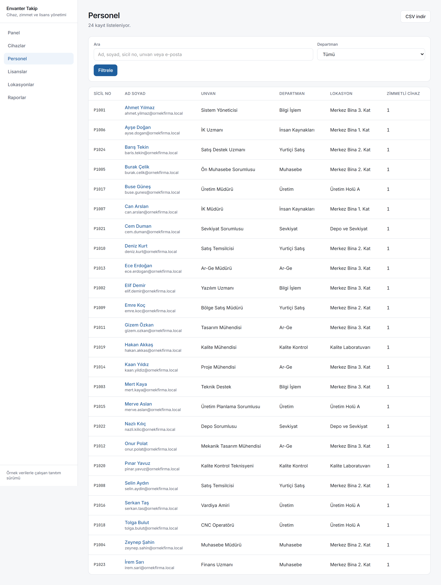

Personel; sicil numarası, unvan, departman, lokasyon ve üzerine zimmetli cihaz
sayısıyla listelenir. Ad, soyad, sicil no, unvan veya e-postaya göre arama ve
departmana göre filtreleme yapılabilir.

### Personel detayı

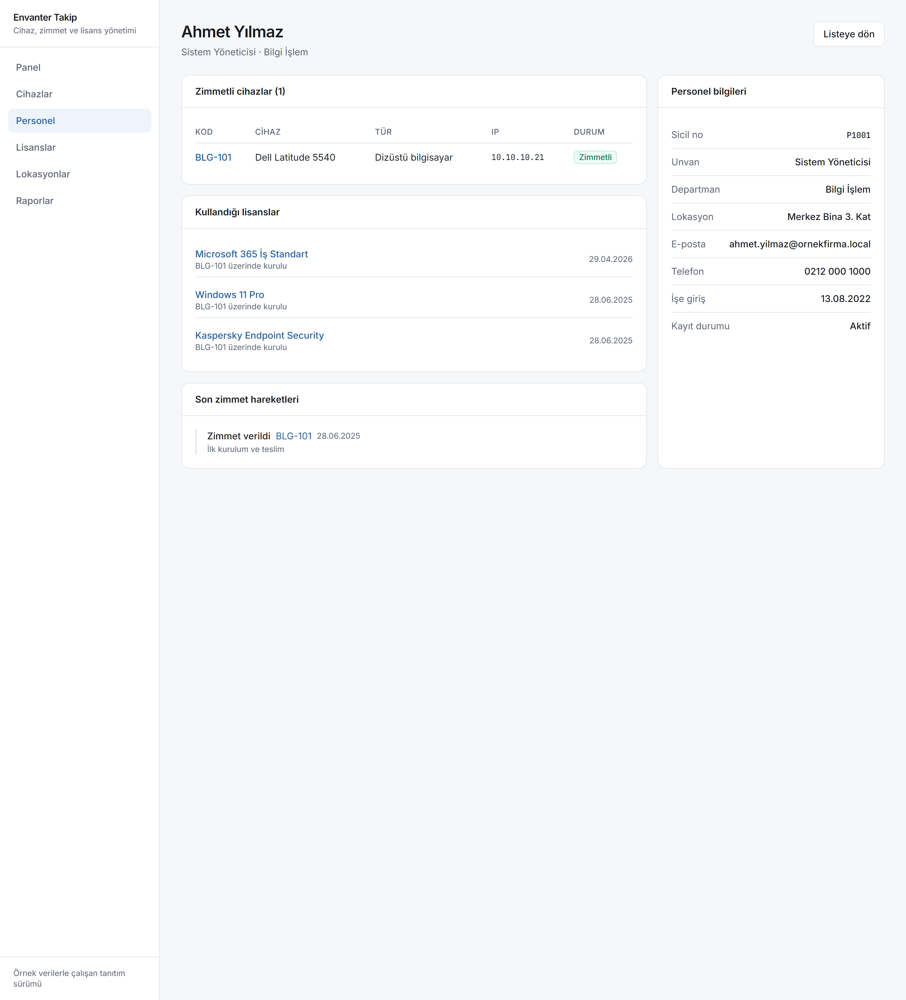

Personelin üzerindeki cihazlar, bu cihazlar üzerinden kullandığı lisanslar ve
zimmet hareketleri tek sayfada toplanır. İşten ayrılış veya departman değişikliği
durumunda hangi donanımın teslim alınması gerektiği buradan görülür.

### Lisans listesi

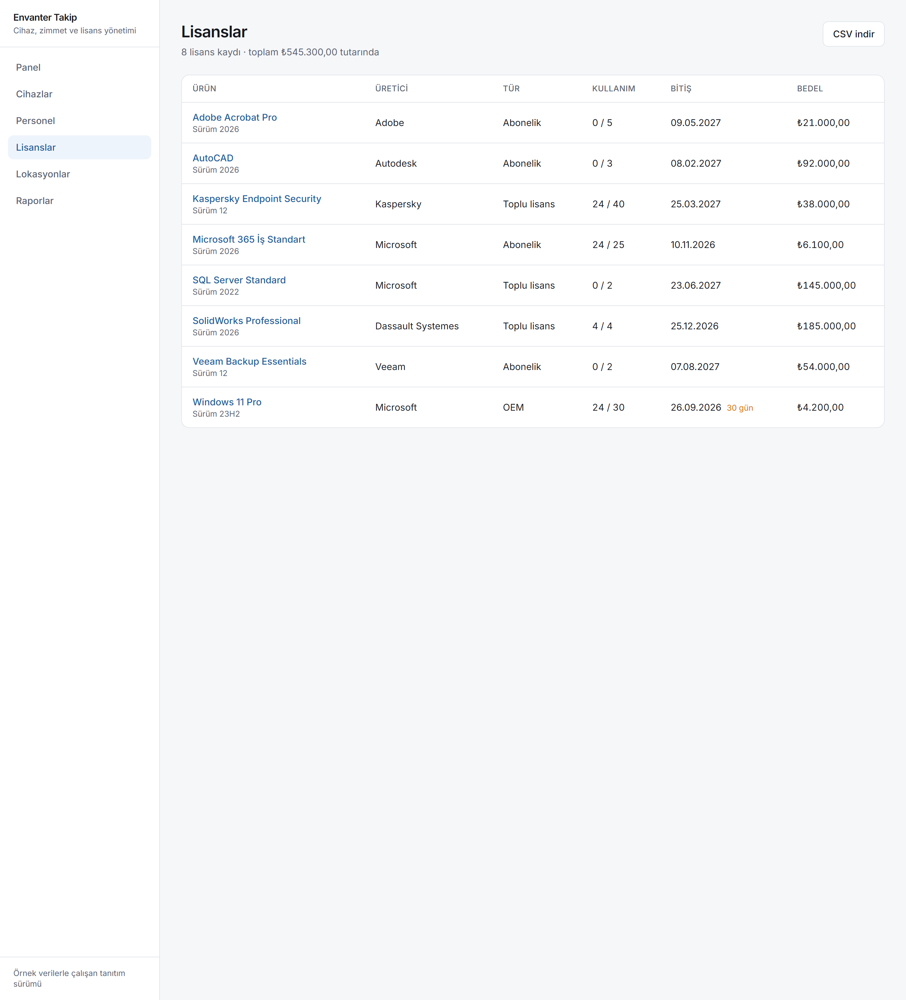

Lisanslar üretici, tür, koltuk kullanımı, bitiş tarihi ve bedeliyle listelenir;
başlıkta kayıt sayısı ve toplam lisans maliyeti gösterilir. Bitişine 60 günden az
kalan kayıtlarda tarih turuncuya döner ve yanında kalan gün sayısı belirir.

### Lisans detayı

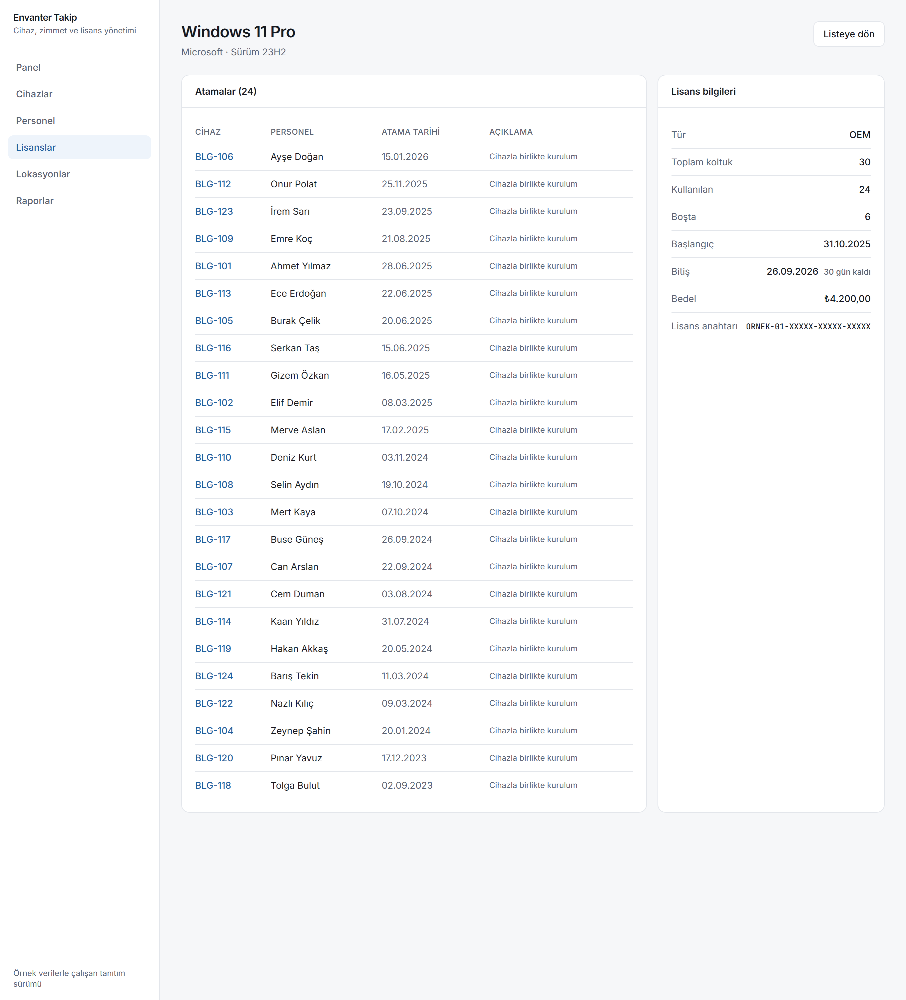

Lisansın hangi cihaz ve personellere atandığı tam liste hâlinde görülür. Sağdaki
kartta toplam, kullanılan ve boştaki koltuk sayısı ayrı ayrı verilir. Lisans
anahtarı yalnızca bu ekranda görüntülenir; CSV çıktısına bilinçli olarak dâhil
edilmez.

### Lokasyon ve departman dağılımı

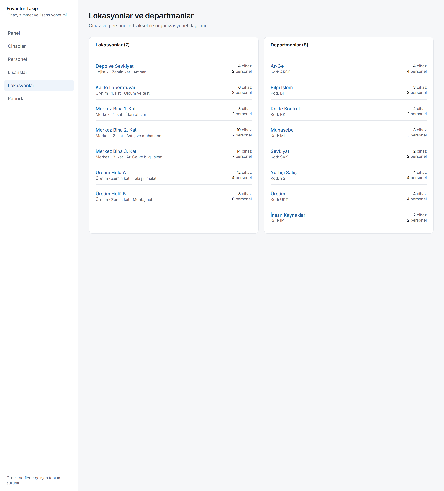

Lokasyonlar ve departmanlar, her birine bağlı cihaz ve personel sayısıyla yan
yana listelenir. Böylece fiziksel dağılım (hangi katta kaç cihaz var) ile
organizasyonel dağılım (hangi departmanda kaç cihaz var) aynı ekrandan
karşılaştırılabilir.

### Raporlar

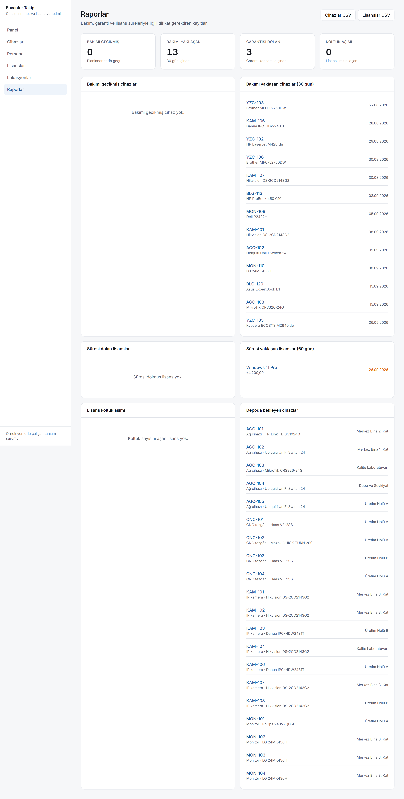

Dikkat gerektiren kayıtlar altı başlıkta toplanır: bakımı gecikmiş cihazlar,
30 gün içinde bakımı yaklaşanlar, süresi dolmuş lisanslar, 60 gün içinde süresi
dolacak lisanslar, koltuk sayısı aşılan lisanslar ve depoda bekleyen cihazlar.
Boş kalan bölümler "kayıt yok" bilgisiyle gösterilir. Sayfanın üstündeki iki
düğme cihaz ve lisans listelerini CSV olarak indirir.

## Teknoloji

| Katman | Kullanılan |
| --- | --- |
| Uygulama çatısı | Next.js 16 (App Router, React Server Components) |
| Dil | TypeScript |
| Arayüz | Tailwind CSS v4 |
| Veri erişimi | Prisma ORM 7 |
| Veritabanı | SQLite (geliştirme) / PostgreSQL (üretim) |

Veri okuma işlemleri sunucu bileşenleri içinde doğrudan Prisma ile yapılır;
veri değiştiren işlemler (zimmet verme, iade, durum güncelleme, cihaz ekleme)
Server Action olarak yazılmıştır. Ayrı bir REST katmanı yalnızca CSV dışa
aktarma için kullanılır.

## Kurulum

```bash
npm install
cp .env.example .env      # DATABASE_URL="file:./dev.db"
npx prisma migrate dev    # tabloları oluştur
npm run db:seed           # örnek veriyi yükle
npm run dev
```

Uygulama `http://localhost:3000` adresinde çalışır.

### Komutlar

| Komut | Açıklama |
| --- | --- |
| `npm run dev` | Geliştirme sunucusu |
| `npm run build` | Üretim derlemesi |
| `npm run db:migrate` | Yeni göç (migration) oluştur ve uygula |
| `npm run db:seed` | Örnek veriyi yükle (mevcut kayıtları siler) |
| `npm run db:reset` | Veritabanını sıfırla ve göçleri yeniden uygula |
| `npm run db:studio` | Prisma Studio ile veriyi görsel olarak incele |
| `npm run ss` | Sayfaların ekran görüntüsünü al (dev sunucusu açıkken) |

### PostgreSQL'e geçiş

`prisma/schema.prisma` içindeki datasource sağlayıcısını değiştirin:

```prisma
datasource db {
  provider = "postgresql"
}
```

`.env` dosyasındaki bağlantı adresini güncelleyin, `src/lib/prisma.ts` ve
`prisma/seed.ts` içindeki `PrismaBetterSqlite3` adaptörünü `PrismaPg` ile
değiştirin (`npm install @prisma/adapter-pg`), ardından `npx prisma migrate dev`
komutunu çalıştırın.

## Veri modeli

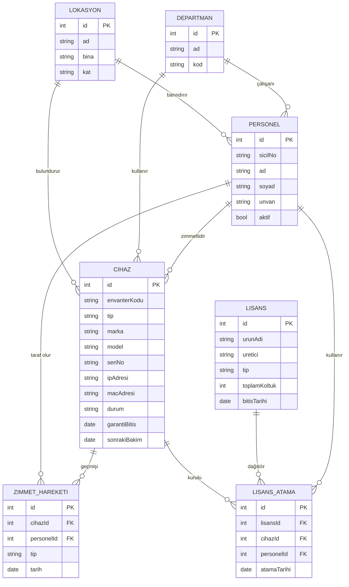
```mermaid
erDiagram
    LOKASYON ||--o{ PERSONEL : "barındırır"
    LOKASYON ||--o{ CIHAZ : "bulundurur"
    DEPARTMAN ||--o{ PERSONEL : "çalışanı"
    DEPARTMAN ||--o{ CIHAZ : "kullanır"
    PERSONEL ||--o{ CIHAZ : "zimmetlidir"
    PERSONEL ||--o{ ZIMMET_HAREKETI : "taraf olur"
    CIHAZ ||--o{ ZIMMET_HAREKETI : "geçmişi"
    CIHAZ ||--o{ LISANS_ATAMA : "kurulu"
    LISANS ||--o{ LISANS_ATAMA : "dağıtılır"
    PERSONEL ||--o{ LISANS_ATAMA : "kullanır"

    LOKASYON {
        int id PK
        string ad
        string bina
        string kat
    }
    DEPARTMAN {
        int id PK
        string ad
        string kod
    }
    PERSONEL {
        int id PK
        string sicilNo
        string ad
        string soyad
        string unvan
        bool aktif
    }
    CIHAZ {
        int id PK
        string envanterKodu
        string tip
        string marka
        string model
        string seriNo
        string ipAdresi
        string macAdresi
        string durum
        date garantiBitis
        date sonrakiBakim
    }
    LISANS {
        int id PK
        string urunAdi
        string uretici
        string tip
        int toplamKoltuk
        date bitisTarihi
    }
    LISANS_ATAMA {
        int id PK
        int lisansId FK
        int cihazId FK
        int personelId FK
        date atamaTarihi
    }
    ZIMMET_HAREKETI {
        int id PK
        int cihazId FK
        int personelId FK
        string tip
        date tarih
    }
```

Zimmet, cihaz üzerinde tek bir alanla (`zimmetliPersonelId`) tutulur; geçmiş ise
ayrı bir `ZimmetHareketi` tablosunda saklanır. Böylece "cihaz şu anda kimde?"
sorusu tek alan okumasıyla, "bu cihaz geçmişte kimlerde kaldı?" sorusu ise
hareket tablosundan yanıtlanır.

## Zimmet iş akışı

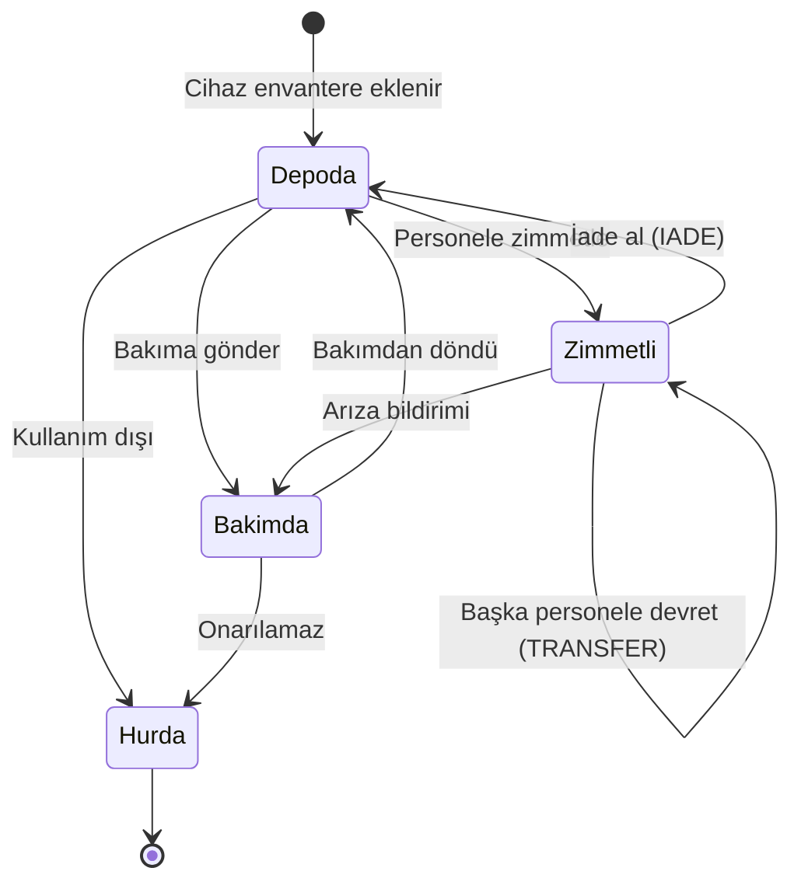
```mermaid
stateDiagram-v2
    [*] --> Depoda: Cihaz envantere eklenir
    Depoda --> Zimmetli: Personele zimmetle
    Zimmetli --> Zimmetli: Başka personele devret (TRANSFER)
    Zimmetli --> Depoda: İade al (IADE)
    Depoda --> Bakimda: Bakıma gönder
    Bakimda --> Depoda: Bakımdan döndü
    Zimmetli --> Bakimda: Arıza bildirimi
    Depoda --> Hurda: Kullanım dışı
    Bakimda --> Hurda: Onarılamaz
    Hurda --> [*]
```

Bir cihaz "Zimmetli" dışındaki bir duruma geçtiğinde mevcut zimmeti otomatik
olarak düşülür. Zimmet devrinde cihaz, hedef personelin lokasyon ve departmanına
taşınır.

## Dizin yapısı

```
src/
  app/
    page.tsx                     Panel (özet göstergeler)
    cihazlar/                    Cihaz listesi, detay, yeni kayıt
      eylemler.ts                Server Action'lar (zimmet, durum, kayıt)
    personel/                    Personel listesi ve detayı
    lisanslar/                   Lisans listesi ve detayı
    lokasyonlar/                 Lokasyon ve departman dağılımı
    raporlar/                    Bakım, garanti ve lisans raporları
    api/disa-aktar/[tur]/        CSV dışa aktarma uç noktası
  components/                    Ortak arayüz bileşenleri
  lib/
    prisma.ts                    Prisma istemcisi (tekil örnek)
    sabitler.ts                  Durum/tür değerleri ve Türkçe etiketleri
    format.ts                    Tarih, para ve gün hesaplama yardımcıları
prisma/
  schema.prisma                  Veri modeli
  seed.ts                        Örnek veri yükleyici
```

## Tasarım kararları

- **Durum alanları neden String?** SQLite `enum` tipini desteklemediği için
  `durum`, `tip` gibi alanlar veritabanında metin olarak tutulur. Geçerli
  değerler `src/lib/sabitler.ts` içinde tek kaynakta tanımlanmış, Server
  Action'larda kayıt öncesi doğrulanmaktadır.
- **Lisans anahtarları dışa aktarılmaz.** CSV çıktısında lisans anahtarı alanı
  bilinçli olarak yer almaz; anahtarlar yalnızca uygulama içinde görüntülenir.
- **Silme yerine ilişki koparma.** Personel veya lokasyon silindiğinde cihaz
  kaydı silinmez, ilgili alan `null` yapılır (`onDelete: SetNull`). Cihaz
  silindiğinde ise ona ait zimmet geçmişi de silinir (`onDelete: Cascade`).
- **Örnek veri deterministiktir.** `prisma/seed.ts` sabit tohumlu bir sözde
  rastgele üreteç kullanır; aynı komut her çalıştırıldığında aynı veri oluşur.
